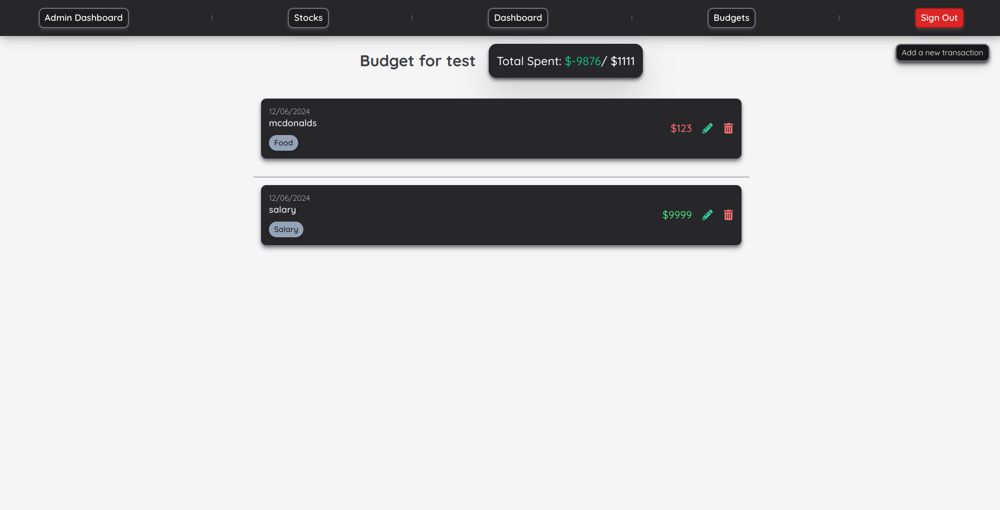

# WealthWatch

This is an app that allows users to create and view budgets and transactions for each budget. Users can also search for and view information about stocks and add them to a list to track them.

## Screenshots

##### Dashboard

##### Budget

##### Transaction

##### Stock

##### Stock Info

##### Admin Dashboard

## Technologies

- NextJS
- Next-Auth
- MongoDB and Mongoose
- Tailwind
- Chart.js
- Polygon.io API
- AlphaVantage API

## Getting Started

[**Demo**](https://p4-wealthwatch.vercel.app/)
 
[**Trello**](https://trello.com/b/YUH5KTr0/wealthwatch)

## Next Steps

- See if budget is exceeded or not in budget page
- Add more stock info in stock page
- Ability to add buy and sell transactions for stock
- Ability to show current value of held stocks

## Challenges

The biggest challenge was learning NextJS especially regarding the server side rendering which I still haven't completely figured out.
Another challenge was trying to get my session info back from next-auth to pass it in to my fetch/api calls.

## Key Takeaways

What I took away from this project is that I learnt a bit about NextJS and how it works.
I also found out that tailwind styles can be applied globally so I didn't need to make styled components.

## Favorite Server Method

Probably the DELETE/PUT methods for the individual transactions. It just goes into the user's budget and removes/updates the transaction.

## Favorite Client Component

I'd say the Chart component as it took me quite a long time to figure it out and get it to work.
